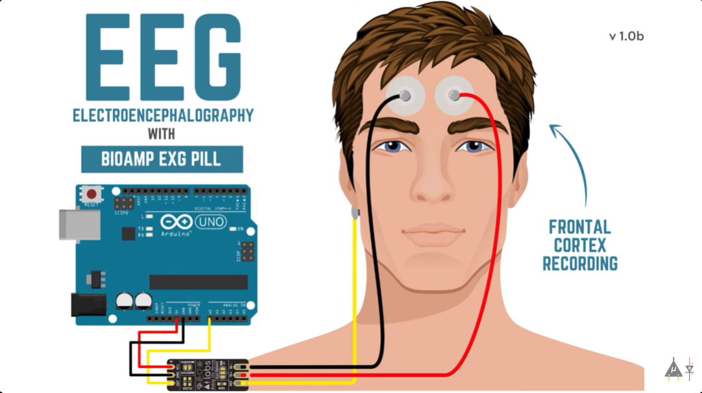

<a name=top></a>
## NATHACKS
# # FocusBoost


See our devpost [FocusBoost](https://devpost.com/software/neuro-stress-monitor)

## 📑 Summary

**FocusBoost** 

**FocusBoost** is a real-time focus detection tool that uses the BioAmp EXG Pill and Arduino to capture brain signals and notify the user when they are focused in an Electron-based application that monitors your focus levels in real-time using data from an Arduino. The application provides notifications and motivational alerts to help you maintain focus and productivity and over a chromium software (for practical example like watching a youtube short). 


## ✨ About
- **Brain wave monitoring** Detects brain waves using BioAmp EXG Pill
- **Filtering for stress** Filters EXG signals into brain wave frequency region (0-50 Hz)
- **Notifications** when filtered signals exit beta frequency range (14-40 Hz).
- **Sound alerts** for real-time focus warnings.


## 📷 Screenshots



## Development Timeline
### November 14
- **Daksh, and Hasan**
  - Started laying the groundwork for the project
### November 15
- **Hasan**
  - Implemented barebones feature of the youtube selenium script to autoskip videos (Next step is to implement exg pill data for the skipping
- **Daksh**
  - Set up the elctron app by creating the renderer files: index(html/js), preload.js, styles.css. Also updated the package.json file and cleaned up other files
  - Dealt with troubleshooting and refinements, fixed GPU crashes through disabling GPU rendering. Debugged other issues so that the window would open properly. Resolved through developing a gitignore file. 
  - Tested window using mock data, used to test real-time visualization of the app. Refined the chart code for better visuals. 
  - Improved other aspects of the project like helping with the arduino data processing, communicating aspects with teamates, cleaned and set up README.md with better setup instructions, and developed how to prompt notifications.
- **Avery**
  - Connected BioAmp EXG Pill to Arduino to begin gathering brainwave signals. Wrote required code in Arduino IDE to begin the aquisition of data from the EXG Pill.
  - Used byb spike recorder to test methods of recording signals to detect focus/stress. Decided on using the EXG as an EEG by connecting it to the forhead, targeting the frontal lobe. ECG data was simple to work with but not necessarily indicitave of focus/stress.
  - Began serial plotting raw EEG data in Arduino IDE to visualize and confirm accuracy.
  - Wrote code to transfer raw EEG data to python stress_monitor.py using pyserial module.
## November 16
- **Hasan**
<<<<<<< HEAD
  - Implemented reading EXG pill data to display notifications on chromium, decided by being focused or unfocused, and closing the page if the person remains unfocused
  - Implemented focus features into youtube shorts and tiktok videos to show an example of our notification feature/data analysis
- **Avery**
  - Continued work on backend in stress_monitor.py by filtering raw EEG data by changing data into frequency domain and using scipy module to implement a bandpass filter for beta waves (14-30 Hz).
  - Made a function to check if the incoming signals are in the beta range based on the beta wave power.
  - If 10% or more of the incoming signals, over the course of a minute, are OUTSIDE of the beta range, the subject is UNFOCUSED. Otherwise they are FOCUSED.
  - stress_monitor.py prints if the subject is FOCUSED or UNFOCUSED as well as the percentage of how UNFOCUSED the subject is. Example output:    Is Unfocused: False (True Percentage: 2.79%).
  - Tested and adjusted frequency ranges to accurately describe the subjects focus ranges.
  - 
- **Daksh**
  - Set up push notifications and sound alerts in the Electron app. Implemented a system to dynamically display notifications for focus/unfocus states and integrated motivational quotes for repeated unfocused instances.
  - Refined notification aesthetics to match a neutral theme with a bright pink tone for alerts, ensuring a visually cohesive interface.
  - Enhanced the renderer functionality, modifying it to dynamically display the current state (e.g., "Current State: Focused/Unfocused") alongside real-time updates.
  - Debugged file read operations to ensure smooth integration with file.txt for displaying state changes accurately.
  - Improved the styles.css file to align the app's visual theme with a modern, neutral mode-inspired look while fine-tuning animations for notifications. Integrated video background functionality for a visually appealing application interface.
  - Reverted multiple files to resolve issues during testing and switched the frontend framework from JavaScript to React, paving the way for a more modular and scalable codebase. But then reverted back into HTML, CSS, and JavaScript for a better connection with backend.  
  - Connected the frontend to the backend, establishing seamless communication between the Electron app and the Arduino hardware for real-time data visualization and monitoring.
  - Tested the Arduino integration, focusing on how it receives and processes signals for seamless communication with the Electron app.
  - Updated and cleaned up README.md, adding contributions, software dependencies, and enhanced setup instructions.
  - Incorporated a dynamic notification system that includes motivational quotes by David Goggins for repeated unfocused states, creating an engaging user experience.
  - Integrated video background functionality for a visually appealing application interface.

## November 17
- **Hasan**
  - Synchronized the buttons in the electron app to execute the python scripts for youtube and tiktok
  - Streamlined the UI of the app

## 🔨 Tools

### Software

This project is built using the following tools and frameworks:

* [GitHub](https://www.github.com) - Version control and project management.
* [Node.js](https://nodejs.org/) - Runs JavaScript in real-time on web app
* [Chart.js](https://www.chartjs.org/) - For real-time charting and data visualization.
* [Electron.js](https://www.electronjs.org/) - For cross-platform desktop app development.
* [Arduino IDE](https://www.arduino.cc/) - For coding and uploading firmware to the Arduino.
* [Chromedriver](https://developer.chrome.com/docs/chromedriver/) - For chromium for youtube/tiktok functionalities

### Python Libraries

The project uses the following Python libraries. Install them using `pip install` or include them in your `requirements.txt` file:

* `selenium>=4.0.0` - For automated testing and interaction simulation.
* `serial


### Hardware

* Bioamp EXG pill for biosignal capture
* Arduino board

# FILE STRUCTURE
```
Neuro-focus-Monitor/
├── __pycache__
│   ├── __pycache__/stress_monitor.cpython-312.pyc
├── .vscode
│   ├── settings.json
├── ARDUINO
│   ├── ARDUINO.ino
├── my-electron-app/               # Main Electron app directory
│   ├── public/                    # Static files for React (used in Electron frontend)
│   │   ├── favicon.ico
│   │   ├── index.html             # Entry point for the Electron-rendered React app
│   │   ├── logo192.png
│   │   ├── logo512.png
│   │   ├── manifest.json          # Metadata for web app (optional for PWA)
│   │   └── robots.txt
│   ├── src/                       # Source files for React app
│   │   ├── App.css
│   │   ├── App.js                 # React app main component
│   │   ├── App.test.js
│   │   ├── index.css
│   │   ├── index.js               # React app entry point
│   │   ├── logo.svg
│   │   ├── reportWebVitals.js     # Optional for performance tracking
│   │   └── setupTests.js          # Optional for React tests
│   ├── main.js                    # Electron main process script
│   ├── package.json               # Dependencies and scripts for Electron app
│   ├── README.md                  # Electron app-specific documentation
│   └── node_modules/              # Dependencies (git ignored)
├── renderer/                  # Electron renderer process
│   ├── alert.mp3              # Sound file for alerts
│   ├── file.txt               # File tracking focus state
│   ├── index.html             # Electron-rendered HTML
│   ├── preload.js             # Preload script for IPC communication
│   ├── renederer.js           # Main script for Electron renderer logic
│   └── styles.css   
├── src/                           # General assets used across the project
│   ├── eeg-image.png              # EEG visualization
│   ├── focusBoost.mp4             # Background video for the app
│   ├── tk-image.png               # Icon for TikTok functionality
│   └── yt-image.png               # Icon for YouTube functionality
├── venv/                          # Python virtual environment (should be git ignored)
├── .gitignore                     # Ignore unnecessary files (e.g., __pycache__, node_modules)
├── README.md                      # General project documentation
├── chromedriver                   # ChromeDriver executable (permission adjusted)
├── chromedriver.exe               # Windows ChromeDriver executable
├── main.js                        # Main Electron process for legacy setup (if needed)
├── package.json                   # Legacy Electron dependencies and scripts (if needed)
├── requirements.txt               # Python dependencies
├── stress_monitor.py              # Python script for monitoring stress
├── tiktok-nav.py                  # TikTok navigation automation script
└── youtube-nav.py                 # YouTube navigation automation script

```
## Code execution guide
```
pip install -r requirements.txt
python stress_monitor.py
npm start

```
Make sure you’ve downloaded ChromeDriver:
*  Go [to ChromeDriver](https://developer.chrome.com/docs/chromedriver/downloads) Downloads.
*  Download the version that matches your Chrome browser version (check chrome://settings/help in Chrome for the version).
*  Extract the ChromeDriver executable.

## 👨‍👧‍👧 Team

<!--- put your links here --->

* [Avery Bettesworth](https://github.com/Betts6430) - Computer Engineering Student
* [Daksh Sethi](https://github.com/daksh3333) - Software Engineering Student
* [Hasan Khan](https://osu.github.io/portfolio/) - Computer Scientist and Psychology Student
* [Hassan Farooq Mohammed ](https://github.com/osu) - Computer Scientist
* [Tatjana Golovin](https://devpost.com/tatjana-golovin) - Neuroscience Student
* [Varinder Singh](https://devpost.com/varinderjeetsingh311) - Psychology Graduate


## 📰 Notes

[](https://opensource.org/licenses/MIT)

* Use your own branch and pull request to main

## Referrences

* BioAmp EXG Pill Documentation (https://github.com/upsidedownlabs/BioAmp-EXG-Pill)
* Serial communication between Python and Arduino (https://projecthub.arduino.cc/ansh2919/serial-communication-between-python-and-arduino-663756)


[🔝 Back to Top](#top)
